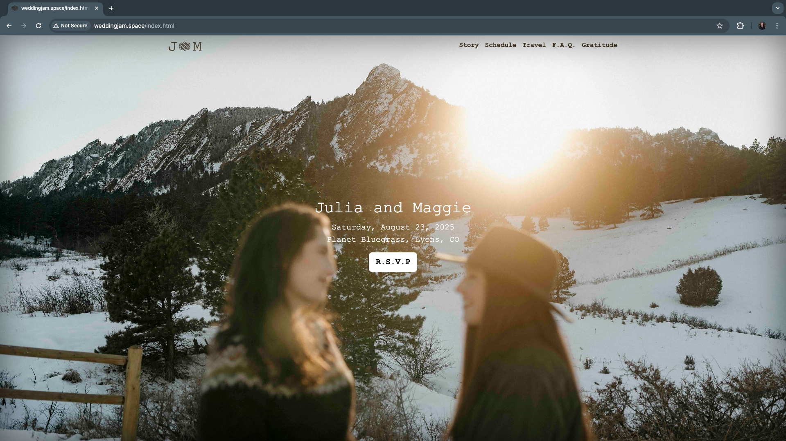

# Wedding J&M

weddingjam.space

I'm proud to have built our wedding website myself using HTML and Bootstrap! I quickly was frustrated with the limitations of existing wedding website builders (no link formatting wth!), and had some experience with Bootstrap through work. This all came together surprisingly quickly.

This responsive website features a full page cover image on the homepage with a transparent navbar, and multiple pages (r.s.v.p., story, travel, f.a.q., and gratitude) that each have a collapsable (on small screens) sticky navbar, a jumbotron full-width image and a footer with a javascript countdown until our wedding date. The travel page additonally has a sidebar because of its length.

I've all but disabled dark mode, which many devices are set to automatically producing unintended CSS effects.

In the spirit of open source, the site code is here. Feel free to reach out to me if you have any questions or are struggling to make a similar website work for you.

## HTML

Website built using the [Bootstrap](https://getbootstrap.com/) toolkit, downloadable with `npm i bootstrap@5.3.3`. And fully customized using HTML, CSS, and JavaScript. Site-wide CSS and JS changes are in `css/custom.css` and `js/custom.js` respectively, but page-relevant CSS is in the head section of each page.

If the site was bigger I would pull out the header and footer code, but since `index.html` has different HTML for these short sections, they are repeated in every other page.

Other tools used: 
 - [Masonry](https://masonry.desandro.com/) for the cascading grid layout for the gallery on our story page. Futher, javascript is used to let images be clicked in an enlarged overlay.
 - [favicon.io](https://favicon.io/) to generate the favicons from our Irish love knot image.
 - [Fotor](https://www.fotor.com/)'s free AI background remover and image-to-SVG for the logo.
 - [Font Awesome](https://fontawesome.com/icons) for free icons used extensively on the travel page.
 - [draw.io](draw.io) is used to generate `.svg` images (family tree and setlist) used on the about page.
 - [Image Color Picker](https://imagecolorpicker.com/) was used to select theme colors from our cover/jumbotron photos.
 - [Responsive BreakPoints](https://responsivebreakpoints.com/) to generate responsive image breakpoints to speed up the website on mobile.

## Services

I chose to use [anRSVP](https://anrsvp.com/) for our wedding RSVPs because it's free and embeddable onto the site.

This service requires an input spreadsheet of first and last names, as well as cooresponding guest number. Each guest can only RSVP for up to that number of additional guests, with the option to force listing their name. Answers can be exported to a spreadsheet as well. Questions are customizable. The "Thank You" card is not my favorite. I wish I had more customizational control over it, but it's free! RSVPify costs ~$130 annually to enable the embedding feature.

We have not chosen a registry service yet, but this is only linked from our F.A.Q. and can be an external site.

## Maps

Topo Maps of NY, VA, CO, and USA are coded in Python using [TIGER/Line U.S. State Shapefiles](https://catalog.data.gov/dataset/tiger-line-shapefile-current-nation-u-s-state-and-equivalent-entities/resource/ac41845b-de1d-4b4f-ab98-0f8573a6b69d) from the U.S. Census Bureau and Earth relief data from the [PyGMT](https://www.pygmt.org/dev/index.html) package. Plotting notebook can be found in `TopoMapMaker/`

Historic USGS maps were found via [topoView](https://ngmdb.usgs.gov/topoview/).

fiverr. artist [@veronikawunder](https://www.fiverr.com/veronikawunder?source=order_page_user_message_link) Veronika W. comissioned for the custom fantasy map of the front range, CO.

[Google My Maps](https://mymaps.google.com/) was used for embedding lodging map since this cannot be done from a Google Maps list.

## Photos

Banner and cover photography by [Angie Wilder](https://angiewilderphoto.com/).

Ring photos by jeweler, Peter Marek, of [Rabbit Jewelry Co](https://rabbitjewelryco.myportfolio.com/work).

**To reduce image loading times, images should be compressed below 200kb**

## Viewing the site locally

In VisualStudio Code, I found it easiest to right click any `.html` page and select "Open in Live Server" to view the site.

Don't forget to inspect in mobile and both light/dark modes.

## Hosting the site

Hosting is free through GitHub pages. I did end up purchasing a domain for a few dollars.